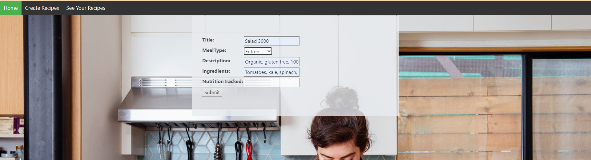
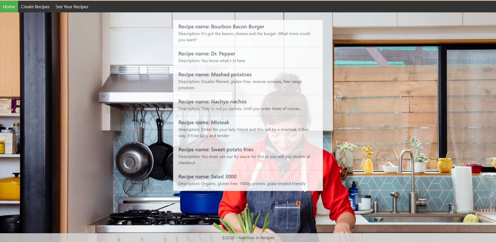

# Django Web Application

The end product of this project was to create a section of a website as a mock-up to show the coding skills of each student in a 2 week long sprint. The technologies we used on the project were Python, Django, SQLite, Git, Azure DevOps, Bootstrap and Pycharm 2020.3.0. We used scrum as our team framework.

## Overview
Since the beginning of this bootcamp, I have been going through tutorials and mostly working on understanding and duplicating what is explained to me. That was essential to my future in computer programming, but I wasn't genuinely challenged to create something on my own with minimal support. This project acted as that challenge to bring the skills I have learned into a realistic simulation of the software dev working environment.

We used Azure DevOps to manage workflow and repos, which taught me a tremendous amount about how to manage communication with my team, push and pull requests, linking documents as well as making concise statements about what I changed in my commits. This process taught me the importance of vigilant awareness while merging and comparing branches and always double checking which branch you have checked out. My ability to write code has improved quite a bit during the course of the project, but more importantly than that, 
I have developed a strong mentality to persist and solve the problem in the face of the inevitable frustration of running into brick wall. Which is very valuable skill to have as a software developer.

# Features I Added

Here I will show you what features I brought to the table for each story I completed.

Story 1 - [Create Model and Scaffolding](CodeDetails/README.md#create-model-and-scaffolding)

Features added:

- Created a model
- Added model to dbcontext
- Created database off of the model and dbcontext using code-first technique
- Scaffolded CRUD views and controllers after database in place

Story 2 - [Make Site-Wide Navbar](CodeDetails/README.md#make-site-wide-navbar)

Features added:

- Created a partial view for the navbar and nested the login partial view inside it
- Nested the navbar in the main layout page of the site to have it shown on all webpages of the site
- Downloaded actual company icon from the original customer's site and displayed on navbar
- Created buttons that will be used for site navigation
- Styled navbar with website color scheme and aligned contents to look clean
- Made navbar responsive to screen size

Story 3 - [Style Create and Edit Pages](CodeDetails/README.md#style-create-and-edit-pages)

The create and edit pages look visually the same, so I only show the create page here

Features added:

- Added title section for clarity
- Styled buttons to look professional
- Added placeholders to form fields
- Aligned buttons and fields in the center of the form
- Aligned and resized form to fit scale of page

Story 4 - [Index Page: Sort Production Photots by Title](CodeDetails/README.md#index-page-sort-production-photos-by-title)

Features added:

- Added bootstrap card classes to contain each database object
- Styled form to fit with site color scheme and page size
- Styled buttons and fields to fit well inside each card
- Grouped each photo with the same title into separate sections
- Used bootstrap grid layout to make cards and page responsive

## Video Walkthrough of Site

Take a look at how the website works (1 minute):

## Skills Learned From Project

Coding skills learned:

- Using Django template language with HTML and CSS

- Connecting URLs in Django

- Importing and file paths in Django

- Connecting models, views, and templates

- Sending variables through URL

- Rendering information from the model using a form

General skills learned:

- Understanding and utilizing version control effectively

- Managing code without damaging the existing codebase

- Improved efficiency of my method of researching errors I run into

- Vastly improved my ability to remain composed in the face of persistent problem
