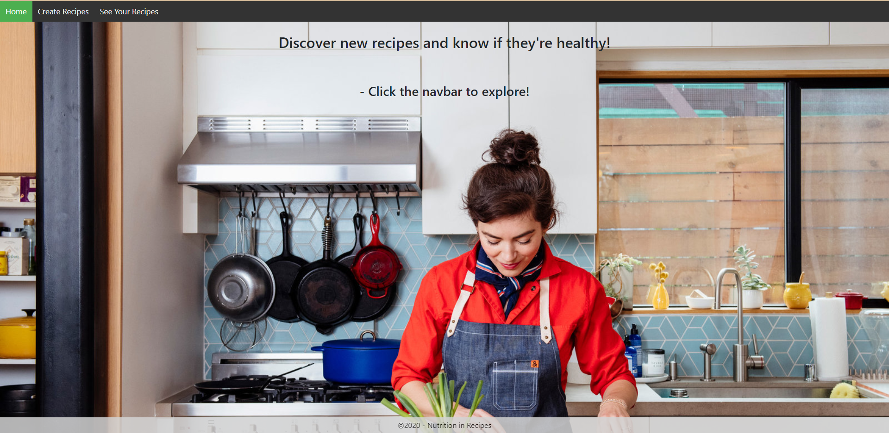
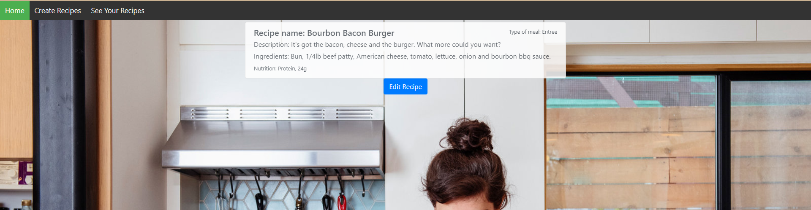
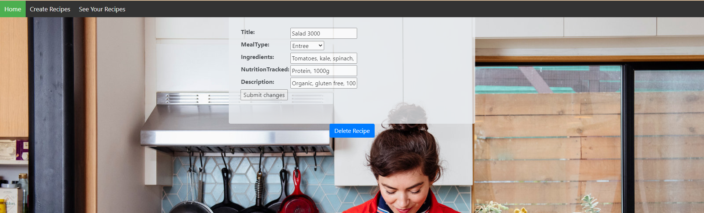
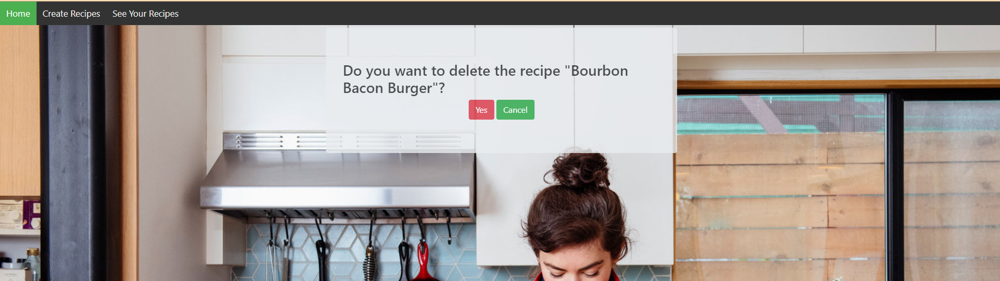

# Django Web Application

## Overview

The end product of this project was to create a section of a mock-website that was intended to help hobbiests keep their collections of items. This was created to show the coding skills of each student in a 2 week long sprint. The technologies we used on the project were Python, Django, SQLite, Git, Azure DevOps, Bootstrap and Pycharm 2020.3.0. We used scrum as our team framework. I decided to make a app in the website called Recipe Tracker.

In this project, I had 5 stories to complete. The first one was the most difficult, where I had to initialize the project and make sure all the details were properly set up. Plus I had to add a home page and a base page (that would be the fundamental web page structure inserted to all other pages), along with a navbar and footer. In the second story, I had the job of creating a model that I could use to set up the database that saved the users' recipes. Then I also needed to make a page that could be used for creating new recipes.

The third story is where I needed to gather all the recipes saved to the database and make an index page to display them to the user. I also needed to style it well. In the forth story, I was tasked with making a page that shows the details of one recipe. Part of this was making each recipe on the index page clickable so that it would take the user to its individual details. The fifth and final story I did required me to make an edit and delete page that the user could access from the details page to modify any given recipe. 

## Features I Added

Here I will show you what features I brought to the table for each story, and it will be accompanied by images to show you what each page looks like. Next to the story number, there will be a title that can be clicked that will take you to the code that I used to complete each story.

Story 1 - [Initialize Project. Make Base and Home Template](Project%20Code/README.md#story-1---initialize-project-make-base-and-home-template)

Features added:

- Navbar and footer loaded separately into the base.html file, which is in every other template file
- Home page created
- Image added to main home page of site that links to my app home page (seen in video below)
- Urls, settings, and other configuration all set up and working

Story 2 - [Create Model, Model Form, Database, and Create Template](Project%20Code/README.md#story-2---create-model-model-form-database-and-create-page)

Features added:

- Model created as base for entire operation
- Database made based on model
- Create page added to make new model object
- View added that uses a model form, adding to create page so the form can be saved to database
- Styled create page with bootstrap and my own css selector

Story 3 - [Make Index Page](Project%20Code/README.md#story-3---make-index-page)

Features added:

- Created template for showing all recipes together
- Added view that passes all recipes from the model to the template
- Used bootstrap and my own css selectors to accomplish good styling
- Implemented a loop using template tags to cycle through all recipes and applying formatting to each

Story 4 - [Details Template](Project%20Code/README.md#story-4---details-template)

Features added:

- Added template for viewing details of an individual recipe
- Made each image in the index page a link to that recipe's detail page
- Created view that passes ID from index page through the URL to the details view then the template
- Used similar styling to the create and edit pages, which saves coding and compiling time

Story 5 - [Edit and Delete Templates](Project%20Code/README.md#story-5---edit-and-delete-templates)

Features added:

- Added template for editing details of recipe, linked from the details page
- Added template to delete recipe, linked from the edit page
- Both have the id of the recipe passed to them through the views I created for them
- The delete function includes the asking for confirmation that the user wants to delete the image

## Video Walkthrough of Site

Take a look at how the website works (1 minute):

Since the beginning of this bootcamp, I have been going through tutorials and mostly working on understanding and duplicating what is explained to me. That was essential to my future in computer programming, but I wasn't genuinely challenged to create something on my own with minimal support. This project acted as that challenge to bring the skills I have learned into a realistic simulation of the software dev working environment.

Looking at this process, I can see some big areas of improvement for myself. One was through the process of using Azure DevOps to manage workflow and repos, which taught me a tremendous amount about how to manage communication with my team, push and pull requests, linking documents as well as making concise statements about what I changed in my commits. This process also taught me the importance of vigilant awareness while merging and comparing branches and always double checking which branch you have checked out. In addition to this, my confidence in my ability to write code has improved quite a bit during the course of the project due to actually being in a realistic working environment and seeing that I can succeed there. But perhaps more importantly than that, I have developed a strong mentality to persist and solve the problem in the face of the inevitable programming frustration of running into brick wall with no solution in sight. Which is very valuable skill to have as a software developer.

## Skills Learned From Project

Coding skills learned:

- Using Django template language with HTML and CSS

- Connecting URLs in Django

- Importing and file paths in Django

- Connecting models, views, and templates

- Sending variables through URL

- Rendering information from the model using a form

General skills learned:

- Understanding and utilizing version control effectively

- Managing code without damaging the existing codebase

- Improved efficiency of my method of researching errors I run into

- Vastly improved my ability to remain composed in the face of persistent problem
